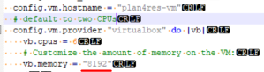
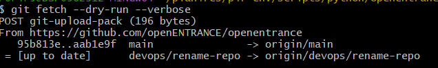

Installing on Windows, using WLS
~~~~~~~~~~~~~~~~~~~~~~~~~~~~~~~~

Follow the procedure *Installing on Linux*  :ref:'installLinux'

Installing on Windows, using Vagrant
~~~~~~~~~~~~~~~~~~~~~~~~~~~~~~~~~~~~

The procedure is available at
https://gitlab.com/cerl/plan4res/p4r-env#windows. It is reproduced below
with some more information.

Installation requires Windows 7 Pro 64bit SP1 or higher and
`PowerShell <https://docs.microsoft.com/en-us/powershell/scripting/install/installing-windows-powershell?view=powershell-6>`__
3.0 or higher. Furthermore, the CPU must support `hardware
virtualization <https://www.virtualbox.org/manual/ch10.html#hwvirt>`__.
On many systems, the hardware virtualization features first need to be
enabled in the BIOS.

Required packages Installation (execute once)
^^^^^^^^^^^^^^^^^^^^^^^^^^^^^^^^^^^^^^^^^^^^^

-  Install Git for Windows (use default settings)
   https://git-for-windows.github.io/

-  Install VirtualBox and *Extension Pack*
   https://www.virtualbox.org/wiki/Downloads

-  Install Vagrant https://www.vagrantup.com/downloads.html

-  (Optional) Install Vagrant Manager
   http://vagrantmanager.com/downloads/

The goal of Vagrant and VirtualBox is to emulate a UNIX system on the
Windows computer. Vagrant Manager provides a GUI to facilitate the
management of the VM.

Installation
^^^^^^^^^^^^

Run Git Bash.

If working behind a proxy, define the following environment variables:

export http_proxy = <proxy address>:<port>

export https_proxy = ${http_proxy}

Move to your installation directory:

cd P4R_DIR

Then enter the following commands:

   git clone https://github.com/plan4res/install

   mv ./install/\* .

   chmod a+x \*.sh

   ./plan4res_install.sh [-S <SOLVER>] [-I <installer>] [-L <license>]
   [-v <version>] -M MPICH -V <memory>

   Where:

-  SOLVER is the chosen solver among CPLEX, GUROBI, SCIP, HiGHS. If this
   option is not provided, HiGHS is chosen

-  Installer is the installer file for CPLEX of Gurobi, the -I option
   must only be provided when CPLEX or GUROBI are chosen

-  License is the license file, only for GUROBI

-  Version is the solver version, only for SCIP

**Examples:**

./plan4res_install.sh -M MPICH -V 8192

-  Installs plan4res with HiGHS

./plan4res_install.sh -M MPICH -V 8192 -S CPLEX -I
cplex_studio2211.linux_x86_64.bin

-  Installs plan4res with CPLEX, using ths installer
   cplex_studio2211.linux_x86_64.bin available in P4R_DIR

./plan4res_install.sh -M MPICH -V 8192 -S GUROBI -I
gurobi11.0.1_linux64.tar.gz -L gurobi.lic

-  Installs plan4res with GUROBI using the gurobi installer and licence
   available in P4R_DIR

./plan4res_install.sh -M MPICH -V 8192 -S SCIP -v 9.1.1

-  Installs plan4res with SCIP, choses the version 9.1.1 from SCIP

Vagrant settings
^^^^^^^^^^^^^^^^

To avoid issues with memory fragmentation while using Vagrant, we advise
to allocate at least 8 Gb of RAM if the computer can afford it. This can
be done via the -V option of the installation command (see above), but
you can also edit the file *Vagrantfile* located in *P4R_DIR/p4r-env*,
edit parameter vb.memory (in Mb):

You may also increase the number of CPUs allocated to the VM if
possible, on your machine. In above example, it is set to 6.

Updating
~~~~~~~~

Update p4r-env
^^^^^^^^^^^^^^

./plan4res_install.sh -U p4r-env

Update StOpt
^^^^^^^^^^^^

./plan4res_install.sh -U stopt

Update SMS++
^^^^^^^^^^^^

./plan4res_install.sh -U sms++

Change the solver
^^^^^^^^^^^^^^^^^

./plan4res_install.sh -S New_SOLVER [ -I installer -L licence -v
version] (installer to be provided in New_SOLVER is CPLEX or GUROBI,
licence to be provided if New_SOLVER is GUROBI, version to be provided
in New_SOLVER is SCIP)

Update the solver
^^^^^^^^^^^^^^^^^

./plan4res_install.sh -S SOLVER -U SOLVER [ -I installer -L licence -v
version] (installer to be provided in New_SOLVER is CPLEX or GUROBI,
licence to be provided if New_SOLVER is GUROBI, version to be provided
in New_SOLVER is SCIP)

Update plan4res scripts and documentation
^^^^^^^^^^^^^^^^^^^^^^^^^^^^^^^^^^^^^^^^^

The following directories can be updated:

-  P4R_DIR/documentation

-  P4R_DIR/p4r-env/scripts/python/openentrance: to update the
   openENTRANCE nomenclature definition.

-  P4R_DIR/p4r-env/scripts/python/plan4res-scripts: to update the data
   processing and visualization scripts

-  P4R_DIR/p4r-env/scripts/include: to update the launching scripts

To check if new versions are available, run the following commands:

1. cd P4R_DIR/p4r-env/scripts/python/openentrance

2. git fetch --dry-run --verbose

If the following output is displayed, it means your installation is up
to date:

Otherwise, you can perform the update using:

3. git pull

Do the same with the repositories
p4r-env/scripts/python/plan4res-scripts and p4r-env/scripts/include if
necessary.

Update example of dataset
^^^^^^^^^^^^^^^^^^^^^^^^^

When installing plan4res, an example of dataset is created in
P4R_DIR/data/toyDataset

As plan4res may have been ran in this dataset, it is not recommended to
update it but to download the last version of this toyDataset:

-  From P4R_DIR/p4r-env/data, change the name of the dataset (mv
   toyDataset toyDataset_save)

-  Download the new version of the dataset:
   git clone https://github.com/plan4res/toyDataset

..
